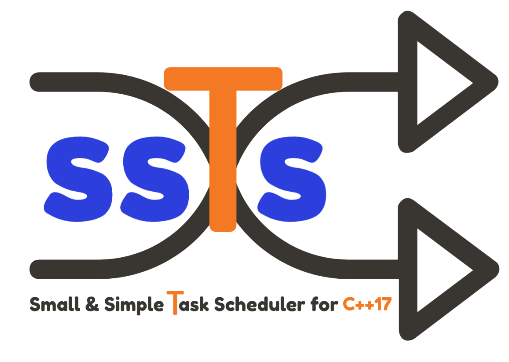

Small & Simple Task Scheduler for C++17

Introduction
============

**ssTs** is a time-based *Task Scheduler*, written in modern C++.  

Header only, with no external dependencies.

**ssTs** features: 

- a ready to use, general purpose *Thread Pool* implementation.
- a *Task Scheduler* APIs to run workloads at given time points.

**ssTs** requires a C++17 compiler.  
Currently the project is built and tested on the following platforms: 

- Windows, MSVC >= 2017, Clang >= 9.0
- Linux, GCC >= 7.5, Clang >= 8.0
- MacOS, GCC >= 8.4, Clang >= 10.0

Licensing
=========

This software is licensed under the MIT license.  
See the `LICENSE <https://github.com/StefanoLusardi/task_scheduler/blob/master/LICENSE>`_ file for details.

.. toctree::
   :caption: Quick Start
   :maxdepth: 1

   quickstart/getting_started
   quickstart/basic_usage

.. toctree::
   :caption: Usage
   :maxdepth: 2

   usage/install
   usage/examples
   usage/tests

.. toctree::
   :caption: API Reference
   :maxdepth: 1

   api/task
   api/task_pool
   api/task_scheduler